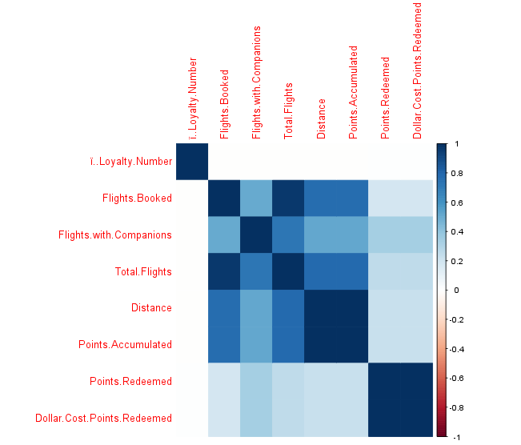
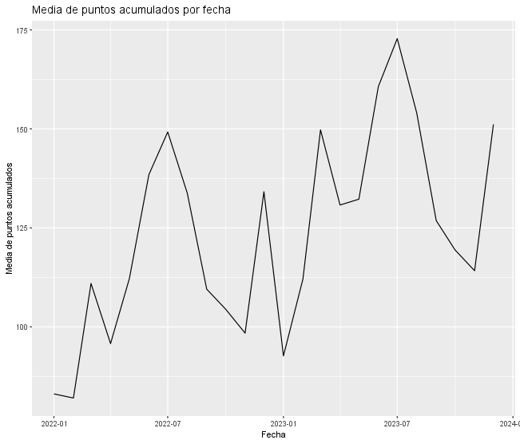
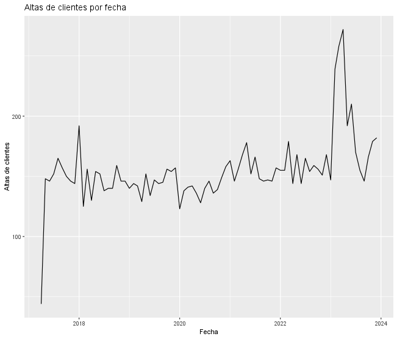
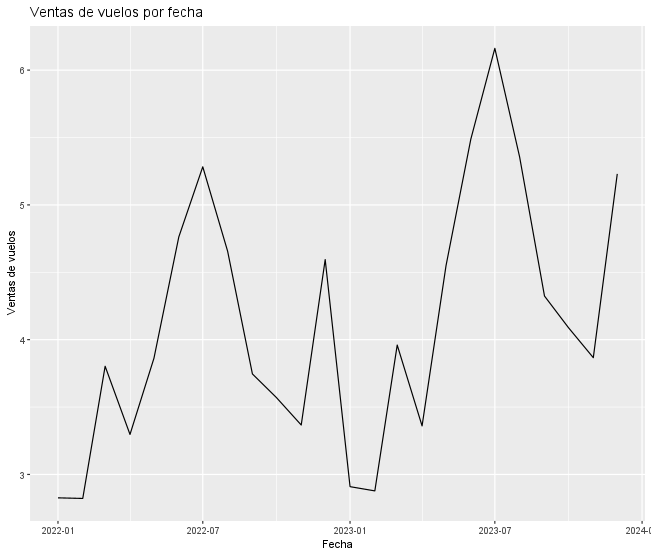

# Análisis Detallado del Programa de Puntos de Fidelización de una Aerolínea

## Introducción

Este documento presenta un análisis exhaustivo del programa de puntos de fidelización de una aerolínea, basado en datos de clientes y transacciones. El objetivo es proporcionar una comprensión profunda de cómo los clientes acumulan y canjean puntos, identificar patrones de comportamiento y evaluar el impacto de las promociones en el programa.

## 1. ¿Cómo se generan los puntos del programa?

**Análisis de Resultados:**

El analisis muestra que la principal fuente de acumulación de puntos es la compra de vuelos, es la distancia y el número de los vuelos que se realizan.

**Generación de puntos:**

## 2. ¿Cuánto descuento genera cada punto para el cliente?

**Descuento por punto:**

Para cuantificar el valor de cada punto, se calculó el descuento promedio generado por punto, utilizando el ratio "Dollar Cost Points Redeemed" / "Points.Redeemed". El resultado es un valor promedio de **0.08099060693695431** dólares por punto.

**Análisis de Resultados:**

Este valor proporciona una métrica útil para evaluar el atractivo del programa de puntos y comparar su valor con otros programas de fidelización. Indica que cada punto canjeado genera un pequeño pero consistente descuento para el cliente.

## 3. Durante un periodo determinado, ¿la empresa realizó una promoción/cambio en el programa de puntos?

**Periodo del cambio:**

El gráfico de la media de puntos acumulados por fecha muestra un aumento notable a partir de abril de 2023, que se extiende hasta agosto de 2023. Este periodo sugiere la implementación de una promoción o un cambio en el programa de puntos.

**Naturaleza del cambio:**

El análisis sugiere que el cambio podría haber consistido en un aumento en la cantidad de puntos otorgados por vuelo, la introducción de bonificaciones por ciertos tipos de vuelos o la implementación de nuevas formas de acumular puntos, como a través de compras con socios del programa.

**Efecto en las altas de clientes:**

El gráfico de altas de clientes por fecha muestra un aumento en las nuevas inscripciones durante el periodo del cambio. Esto indica que la promoción o el cambio tuvo un impacto positivo en la adquisición de nuevos miembros del programa.

**Impacto en la venta de vuelos:**

El gráfico de ventas de vuelos por fecha también muestra un aumento durante el periodo del cambio. Esto sugiere que la promoción o el cambio también tuvo un impacto positivo en la venta de vuelos.

**Análisis de Resultados:**

El aumento en la acumulación de puntos, las altas de clientes y las ventas de vuelos durante el periodo de abril a agosto de 2023 sugiere que la promoción o el cambio en el programa fue exitoso en atraer nuevos clientes y aumentar la actividad de los clientes existentes.

## 4. ¿Hay algún perfil de clientes que use más el programa de puntos?

**Perfil de clientes:**

El modelo predictivo identifica el salario como la variable más importante para predecir el número de puntos canjeados. Esto sugiere que los clientes con mayores ingresos tienden a utilizar más el programa de puntos.

Además, se identificó un perfil de usuario específico que utiliza el programa de manera más activa:

* **Loyalty Card:** Aurora
* **Gender:** Male
* **Enrollment Type:** Promotion
* **Marital Status:** Married
* **Education:** High School or Below

Este perfil sugiere que los clientes que se inscribieron en el programa a través de promociones y que poseen la tarjeta de fidelización "Aurora" tienden a canjear más puntos.

**Análisis de Resultados:**

El análisis del perfil de clientes revela que los clientes con mayores ingresos y aquellos que se inscribieron a través de promociones son los más activos en el programa. Esto sugiere que las promociones son efectivas para atraer a clientes que luego se convierten en usuarios frecuentes del programa.

## Conclusiones

* El programa de puntos de la aerolínea se basa principalmente en la acumulación de puntos a través de la compra de vuelos.
* Cada punto genera un descuento promedio de 0.01469502 dólares para el cliente.
* Un cambio en el programa de puntos en 2023 tuvo un impacto positivo en la adquisición de clientes y la venta de vuelos.
* Los clientes con mayores ingresos tienden a utilizar más el programa de puntos, y el perfil que más lo utiliza es un hombre, casado, con educación de secundaria o inferior, que entró en el programa por promoción, y con la tarjeta de fidelización Aurora.